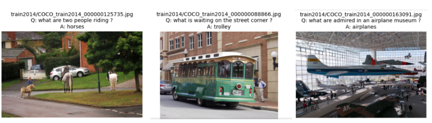

# 🧠 Visual Question Answering 
This project implements a Visual Question Answering (VQA) pipeline using two model architectures:
- 🔹 LSTM + CNN
- 🔸 Attention
---
## 📁 Dataset
The dataset used for this project is the COCO-QA dataset.



## 🔧 Setup
### 1. Create a virtual environment
```bash
python -m venv vqa_env
source vqa_env/bin/activate
```
### 2. Install the required packages
```bash
pip install -r requirements.txt
```
### 3. Download the dataset
```bash
python data/cocoqa_preprocess.py
```
## 🧼 Preprocessing
### 1. Create Question Features
```bash
python data/preprocessing.py
```
### 2. Create Image Features
Run notebook: `data/processing.ipynb` on Kaggle/Colab to use GPU for faster processing.
## 🚀 Training
### 1. LSTM + Multimodal Fusion
```bash
python train_lstm.py --batch_size 16 --max_epochs 1000
```
### 2. Attention
```bash
python train_attention.py --batch_size 16 --max_epochs 1000
```
## 🧪 Evaluation
You can use notebook `vqa_main.ipynb` for end-to-end training and evaluation.